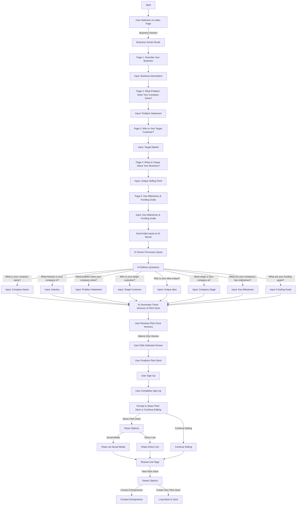
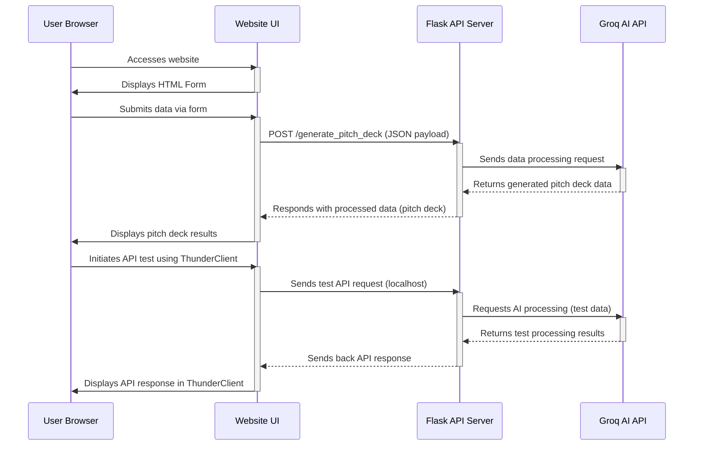

# Pitch Deck Maker Task Guide for Setting Up and Using the Groq API with ThunderClient and Flask for Business Owners

This guide will help you set up and use the Groq API to generate pitch decks from user inputs. You will learn how to set up a Flask API, integrate it with Groq's AI services, and use ThunderClient in VSCode to test your API.

## Overview

The objective is to create a system that collects information from users about their business and then uses AI to generate a pitch deck. This guide will cover:

1. Generating a Groq API key
2. Setting up the project structure
3. Creating the necessary Python files
4. Installing dependencies
5. Running the Flask application
6. Testing the API using ThunderClient

### What is a Pitch Deck?

A pitch deck is a brief presentation that provides an overview of your business. It is used by entrepreneurs to pitch their business ideas to potential investors, customers, partners, and co-founders. The purpose of a pitch deck is to spark interest in your business and secure a meeting with the potential investor.

### Typical Components of a Pitch Deck:

1. **Cover Slide**: Business name, logo, tagline, presenter's name, and date.
2. **Introduction**: Overview of the business and mission statement.
3. **Problem Statement**: The problem your company is solving and the pain points of your target customers.
4. **Solution**: Description of your products or services and your unique selling proposition.
5. **Market Opportunity**: Industry overview, market size, target customers.
6. **Business Model**: Revenue streams and primary revenue source.
7. **Go-To-Market Strategy**: Marketing strategies and customer acquisition methods.
8. **Traction**: Key milestones and customer testimonials.
9. **Business Goals**: Short-term and long-term goals, key performance indicators (KPIs).
10. **Competitive Analysis**: Main competitors, strengths and weaknesses compared to them.
11. **Team**: Key team members and their relevant experience.
12. **Financial Projections**: Revenue forecasts, break-even analysis.
13. **Funding Requirements**: Amount of funding required, allocation of funds, expected return on investment (ROI).
14. **Challenges and Risks**: Challenges your business faces and mitigation strategies.
15. **Closing**: Summary of the business opportunity and call to action.
16. **Appendix**: Additional data, detailed financials, other relevant information.

### Examples of Pitch Decks:

- **Airbnb**: A well-known pitch deck that helped Airbnb secure its initial funding.
- **Buffer**: A simple and effective pitch deck used by Buffer to raise $500,000.
- **Uber**: The pitch deck that helped Uber raise $1.57M in seed funding.

### Why Work on This Project?

Working on this project will give you practical experience with:

- Building and deploying Flask applications.
- Integrating with AI services via APIs.
- Handling JSON data and managing environment variables.
- Testing APIs using tools like ThunderClient.
- Developing a solution that has real-world applications for business owners seeking investment.

You can paste this code into mermaid to get a better understanding
https://mermaid.live/

[Online FlowChart & Diagrams Editor - Mermaid Live Editor](https://mermaid.live/)



So a business owner will be asked a variety of different questions And the answers will be Sent to a backend server where we will be processing those answers with AI to give that business owner a PitchDeck

Image of Website input field


### This data will be sent In Json format to you here's an example of the data

- You will be  receiving this request from the website

```json
{
  "businessName": "My Awesome Startup",
  "industry": "Technology",
  "productsServices": "We offer innovative AI solutions.",
  "targetCustomer": "Our target customers are enterprises.",
  "uniqueSellingProposition": "Our solution is unique because of our cutting-edge technology.",
  "businessGoals": "Our short-term goals are to double our user base. Our long-term goals are to become a market leader.",
  "businessChallenges": "The biggest challenges we face are competition and market adoption.",
  "websiteLink": "http://myawesomestartup.com"
}

```

### Your job is to Use Python to process The request And create a pitch deck using AI

```python
   @@
   @@
   @@
   @@
   @@
\  @@  /
 \ @@ /
  \@@/
   \/

```

## **Python program with AI**

The AI will take the data above using those questions and create a pitch deck

```python
   @@
   @@
   @@
   @@
   @@
\  @@  /
 \ @@ /
  \@@/
   \/

```

Below is A example response that you should get From the AI This is a Response PitchDeck that a business owner Would be interested in

```json
{
  "businessName": "My Awesome Startup",
  "logo": "URL to logo",
  "tagline": "Innovating the Future",
  "presenterName": "John Doe",
  "date": "2024-07-27",
  "overview": "Our Business is My Awesome Startup.",
  "missionStatement": "Our mission is to innovate the future.",
  "problem": "The problem we are solving is inefficiency in AI processes.",
  "painPoints": "Our target customers are facing high costs and low efficiency.",
  "productsServices": "We offer innovative AI solutions.",
  "uniqueSellingProposition": "Our solution is unique because of our cutting-edge technology.",
  "industry": "Technology",
  "marketSize": "The market size is $10 billion and it is growing at 20% annually.",
  "targetCustomers": "Our target customers are enterprises.",
  "revenueStreams": "We generate revenue through subscription services.",
  "primaryRevenueSource": "Our primary source of income is subscription fees.",
  "marketingStrategies": "Our marketing strategy includes digital marketing and partnerships.",
  "customerAcquisitionMethods": "We plan to acquire customers through targeted advertising.",
  "keyMilestones": "We have achieved a user base of 1000 customers.",
  "customerTestimonials": "Our customers have said our product is revolutionary.",
  "shortTermGoals": "Our short-term goals are to double our user base.",
  "longTermGoals": "Our long-term goals are to become a market leader.",
  "kpis": "We measure success through user growth and revenue.",
  "competitors": "Our main competitors are big tech companies.",
  "strengthsAndWeaknesses": "Compared to them, we have a unique technology but lack their resources.",
  "keyTeamMembers": "Our team includes experts in AI and business.",
  "revenueForecasts": "We project our revenue to be $5 million over the next year.",
  "breakEvenAnalysis": "Our break-even point is expected in 6 months.",
  "fundingAmount": "We are seeking $5 million in funding.",
  "allocationOfFunds": "The funds will be used for R&D, marketing, and expansion.",
  "expectedROI": "Investors can expect an ROI of 20% annually.",
  "challenges": "The biggest challenges we face are competition and market adoption.",
  "mitigationStrategies": "We plan to mitigate these risks through continuous innovation.",
  "businessOpportunity": "In summary, we offer a groundbreaking solution in a growing market.",
  "callToAction": "We are excited to partner with investors to drive growth.",
  "additionalData": "Additional data and research available upon request.",
  "detailedFinancials": "Detailed financials are available in our financial report.",
  "otherInformation": "Other relevant information can be provided upon request."
}

```

## Project Directory Structure

```bash
my_pitchdeck_project/
│
├── app.py                # Main Flask application file
├── pitch_deck_generator.py # Module to handle pitch deck creation logic
├── requirements.txt      # Python dependencies file
├── .env                  # Environment variables file storing API keys, etc.
│
├── templates/            # Directory for storing templates
│   └── pitch_deck_template.json  # JSON template for the pitch deck
│
├── tests/                # Directory for storing test scripts
│   └── test_api.py       # Test script for API endpoints
│
└── README.md             # Project documentation and setup instructions
```

## Step 1: Clone the git hub repository

👇 full comprehensive git guide can be found right here 👇

[Git Guide](https://www.notion.so/Git-Guide-31a6be2d5cb24ec08c9e00102a1e6ee1?pvs=21)

## Step 2: Generate Your Groq API Key 🔑✨

### 🚀 Sign Up or Log In to Groq Console:

1. 🌐 Head over to the [Groq Console](https://console.groq.com/keys).
2. 📝 Sign up for an account if you don't already have one. (It's quick and easy!)

### 🔐 Generate Your Shiny New API Key:

1. 📂 Navigate to the **API Keys** section.
2. ➕ Click on **Create API Key**.
3. 🔒 Save that precious key securely. Your new API key is ready to rock!

Resources at: [groq documentation](https://console.groq.com/docs/quickstart)

## Step 3: Set Up the Project Structure

After cloning the Git repository (which is in step one 😄), we want to navigate to that file. The file should be called something along the lines of “pitchdeckAI” and can be found in the file you chose to clone it in. We first want to navigate to that file

### Create the project directory:

```bash
cd C:\path\to\your\pitchdeckAI
```

### Create and activate a virtual environment:
Run one of the commands based on your operating system!

### Windows

1. if you are given a repository where a “pitchdeck_env” file already exists, we first need to delete that (skip to step 2 if the file does not exist 😄). Write this command in your terminal in the project directory. 

```powershell
Remove-Item -Recurse -Force pitchdeck_env
```

  2.  Now that the file no longer exists, we need to create one, we write the following command in the terminal.

```powershell
python -m venv pitchdeck_env
```

1. Now that we have created the *pitchdeck_env file,*  we can now activate the venv *and* install all the dependencies. We write the following in terminal

```powershell
pitchdeck_env\Scripts\activate  

pip install -r requirements.txt
```

```bash

pitchdeck_env\Scripts\activate # On Windows, use`pitchdeck_env\Scripts\activate`

```

The above code block sometimes does not work on Windows due to an administrator error. shown here 

```powershell
pitchdeck_env\Scripts\activate : File C:\your\file_path\pitchdeckAI\pitchdeck_env\Scripts\Activate.ps1 cannot be loaded
because running scripts is disabled on this system. For more information, see about_Execution_Policies at
```

 But no worries! Here's a simple way to solve this:

1. 🚀 **Open Terminal in Admin Mode:**
    - Right-click the Start button (or press `Windows + X`).
    - Select **Windows Terminal (Admin)** or **Command Prompt (Admin)**.
2. 🛠️ **Run the Commands:**
    
    ```powershell
    Get-ExecutionPolicy
    
    #this should return somthing like "Restricted"
    ```
    

```bash
Set-ExecutionPolicy RemoteSigned

# this will set the execution policy from restricted to remote signed, which will allow us to activate the .env file

#running Get-ExecutionPolicy will now return RemoteSigned 
```

And that's it! 🎉 If you re-run the instructions to create the .env, it should work!

Linux

```bash

python3 -m venv pitchdeck_env

```

### Create necessary directories:

```bash

mkdir templates

```

## Step 3: Creating, deleting and editing the .env File ✏️🔒

To improve security and manage environment variables more effectively, edit the existing `.env` file to store sensitive information like your API key.

### ✏️ Edit .env file:

Open the `.env` file and add the following content:

```

*GROQ_API_KEY*=yourapikey

```

### Update `app.py` to load environment variables from `.env`:

First, install the `python-dotenv` package:

```bash

pip install python-dotenv

```

Then, modify `app.py` to use `python-dotenv`:

```python
import os
import time
from flask import Flask, request, jsonify
from datetime import datetime, timedelta
from dotenv import load_dotenv
from groq import Groq

# Load environment variables
load_dotenv()

app = Flask(__name__)
last_request_time = datetime.now()
request_interval = timedelta(seconds=2)  # To respect the retry-after rate limit

@app.route('/pitch_deck_generator', methods=['POST'])
def main():
    global last_request_time

    user_responses = request.get_json()

    if not user_responses:
        return jsonify({'error': 'Invalid input'}), 400

    # Generate the pitch deck using the responses
    pitch_deck = {}
    context = ""

    sections = {
        "Cover Slide": [
            "Business name",
            "Tagline",
            "Presenter's name and title",
            "Date"
        ],
        "Introduction": [
            "Overview of the business",
            "Mission statement"
        ],
        "Problem Statement": [
            "The problem your company is solving",
            "Pain points of your target customers"
        ],
        "Solution": [
            "Description of your products or services",
            "Your unique selling proposition "
        ],
        "Market Opportunity": [
            "Industry overview",
            "Target customers"
        ],
        "Business Model": [
            "Revenue streams",
            "Primary revenue source"
        ],
        "Go-To-Market Strategy": [
            "Marketing strategies",
            "Customer acquisition methods"
        ],
        "Business Goals": [
            "Short-term and long-term goals",
            "Key performance indicators (KPIs)"
        ],
        "Competitive Analysis": [
            "Main competitors",
            "Strengths and weaknesses compared to them"
        ],
        "Challenges and Risks": [
            "Challenges your business faces",
            "Mitigation strategies"
        ],
        "Closing": [
            "Summary of the business opportunity",
            "Call to action"
        ]
    }

    for section, prompts in sections.items():
        if (datetime.now() - last_request_time) < request_interval:
            time.sleep((request_interval - (datetime.now() - last_request_time)).total_seconds())

        section_content = generate_section(section, prompts, user_responses, context)
        pitch_deck[section] = section_content
        context += f"{section}: {section_content}\n"
        last_request_time = datetime.now()

    return jsonify({'message': 'Pitch deck created', 'pitch_deck': pitch_deck})

def generate_section(section, prompts, responses, context):
    # Retrieve the API key from environment variables
    api_key = os.environ.get("GROQ_API_KEY")
    if not api_key:
        raise ValueError("GROQ_API_KEY environment variable is not set")

    # Initialize the Groq client with the API key
    client = Groq(api_key=api_key)

    prompt = f"""Based on the following information, generate the {section} section of a pitch deck:

Context:
{context}

User Input:
{str(responses)}

Please provide concise answers to the following prompts for the {section} section:

"""
    for prompt_item in prompts:
        prompt += f"- {prompt_item}\n"

    prompt += "\nEnsure your responses are relevant to the given user input and maintain consistency with previous sections."

    completion_params = {
        "model": "llama3-8b-8192",
        "messages": [{"role": "user", "content": prompt}],
        "temperature": 0.7,
        "max_tokens": 500,
        "top_p": 1,
        "stream": True,
        "stop": None,
    }

    try:
        completion = client.chat.completions.create(**completion_params)
        section_content = []
        for chunk in completion:
            content = chunk.choices[0].delta.content
            if content:
                section_content.append(content)
                print(content, end="")  # Print the content as it's received
        return ''.join(section_content)
    except Exception as e:
        return f"An error occurred: {e}"

if __name__ == "__main__":
    app.run(debug=True, port=5001)

```

### Create `requirements.txt`:

```

flask
requests
python-dotenv

```

### Install dependencies:

```bash
pip install -r requirements.txt

```

## Step 5: Set Up and Run the Flask Application

### Set the Groq API Key:

```bash
export GROQ_API_KEY='yourapikey'

```

### Run the Flask Application:

```bash
python app.py

```

### Testing the API

1. **Send a Request** using a tool like ThunderClient or Postman.
2. **Review the response** to ensure the pitch deck is generated correctly.

## Step 5: Testing the API Using ThunderClient

1. **Open VSCode** and install the **ThunderClient** extension if not already installed.




### Explanation of the Diagram

1. **User Browser**: This represents the user's browser where they interact with the web application.
2. **Website UI**: The user interface of the website, which hosts forms and other interactive elements.
3. **Flask API Server**: The backend server running Flask that handles requests from the web UI, processes them, and communicates with external services (like the Groq AI API).
4. **Groq AI API**: The external AI service that processes data and returns insights or generated content, in this case, a pitch deck.

### Detailed Steps:

- **Accessing the Site**: The user accesses the website, which loads and displays an HTML form.
- **Form Submission**: The user inputs data into the form and submits it.
- **API Communication**: The website sends this data to the Flask API server as a JSON payload via a POST request.
- **Data Processing**: The Flask server sends this data to the Groq AI API for processing.
- **Result Handling**: The Groq AI API processes the data and sends back the pitch deck information to the Flask server, which then sends it to the website UI.
- **Display Results**: The website UI receives the pitch deck data and displays it to the user.

### Testing with ThunderClient:

- **API Testing**: The intern can use ThunderClient (a VSCode extension) to manually send requests to the Flask API server hosted on `localhost`. This helps in understanding and validating the API's behavior before deployment.
- **Local Testing**: Since the server runs locally during development (`localhost`), it allows for immediate testing and feedback without deploying the server to an external environment.

TODO: Change the image and make sure that the image matches up to the URL that we're going to have so we're going to have API `http://127.0.0.1:5000/api/generate_pitch_deck/`

### 

1. **Open VSCode Look for the four boxes icon on vscode** and install the **ThunderClient** extension  if not already installed.
2. **Open ThunderClient** and create a new request:
    - **Method**: POST
    - **URL**: `http://127.0.0.1:5000/api/generate_pitch_deck/`
    - **Headers**: `Content-Type: application/json`
    - **Body**: (Select JSON format)


### Below should be a example of your response

```json

{
  "businessName": "My Awesome Startup",
  "logo": "URL to logo",
  "tagline": "Innovating the Future",
  "presenterName": "John Doe",
  "date": "2024-07-27",
  "overview": "Our Business is My Awesome Startup.",
  "missionStatement": "Our mission is to innovate the future.",
  "problem": "The problem we are solving is inefficiency in AI processes.",
  "painPoints": "Our target customers are facing high costs and low efficiency.",
  "productsServices": "We offer innovative AI solutions.",
  "uniqueSellingProposition": "Our solution is unique because of our cutting-edge technology.",
  "industry": "Technology",
  "marketSize": "The market size is $10 billion and it is growing at 20% annually.",
  "targetCustomers": "Our target customers are enterprises.",
  "revenueStreams": "We generate revenue through subscription services.",
  "primaryRevenueSource": "Our primary source of income is subscription fees.",
  "marketingStrategies": "Our marketing strategy includes digital marketing and partnerships.",
  "customerAcquisitionMethods": "We plan to acquire customers through targeted advertising.",
  "keyMilestones": "We have achieved a user base of 1000 customers.",
  "customerTestimonials": "Our customers have said our product is revolutionary.",
  "shortTermGoals": "Our short-term goals are to double our user base.",
  "longTermGoals": "Our long-term goals are to become a market leader.",
  "kpis": "We measure success through user growth and revenue.",
  "competitors": "Our main competitors are big tech companies.",
  "strengthsAndWeaknesses": "Compared to them, we have a unique technology but lack their resources.",
  "keyTeamMembers": "Our team includes experts in AI and business.",
  "revenueForecasts": "We project our revenue to be $5 million over the next year.",
  "breakEvenAnalysis": "Our break-even point is expected in 6 months.",
  "fundingAmount": "We are seeking $5 million in funding.",
  "allocationOfFunds": "The funds will be used for R&D, marketing, and expansion.",
  "expectedROI": "Investors can expect an ROI of 20% annually.",
  "challenges": "The biggest challenges we face are competition and market adoption.",
  "mitigationStrategies": "We plan to mitigate these risks through continuous innovation.",
  "businessOpportunity": "In summary, we offer a groundbreaking solution in a growing market.",
  "callToAction": "We are excited to partner with investors to drive growth.",
  "additionalData": "Additional data and research available upon request.",
  "detailedFinancials": "Detailed financials are available in our financial report.",
  "otherInformation": "Other relevant information can be provided upon request."
}

```

1. **Send the Request** and review the response to ensure the pitch deck is generated correctly.

By following these steps, you will have a complete setup for your project, including the necessary files and environment configurations. This setup will allow you to generate pitch decks using the Groq API and test the functionality using ThunderClient in VSCode.

## Summary

This guide provides a step-by-step approach to setting up a project that uses the Groq API to generate pitch decks from user inputs. By following the instructions, you will have a Flask application capable of processing user data and generating detailed pitch decks. This project can be extended and customized based on specific needs.

### Key Points:

1. **Groq API Key**: Ensure you have a valid API key from Groq.
2. **Project Structure**: Set up the project with the necessary files and directories.
3. **Flask Application**: Implement a Flask application to handle requests.
4. **Testing**: Use ThunderClient in VSCode to test your API endpoints.
5. **Security**: Use a `.env` file to manage environment variables securely.

By following this guide, you will be able to create a functional API that leverages AI to generate pitch decks, which can be incredibly useful for business presentations and investor meetings.